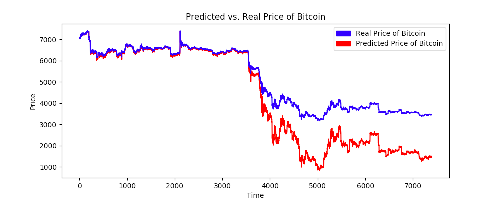
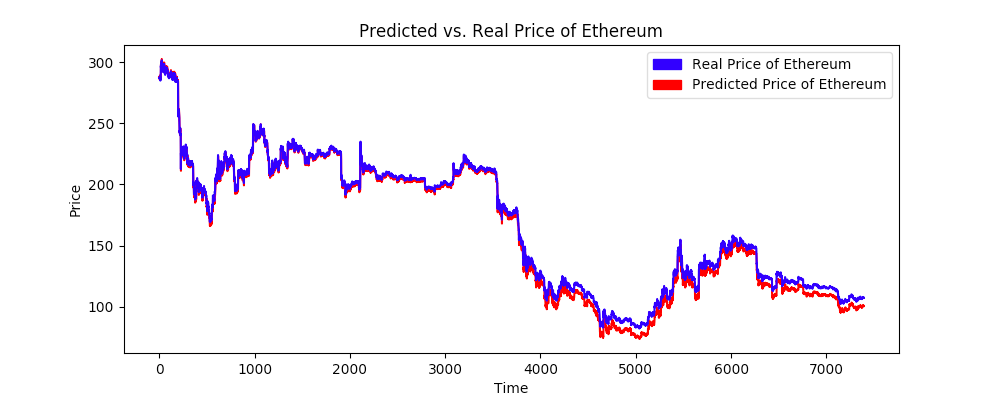

# Minotaur
## Long term cryptocurrency price predictor 💸


### Before starting:
Create an API key via the [Binance Api](https://www.binance.com/userCenter/createApi.html) and replace the empty strings with your keys on each script you want to run.
````bash
pipenv shell

# Install dependencies (using Pipenv)
sudo pipenv install --skip-lock

# Train models
cd models
python btcmodel.py
python ethmodel.py
python ltcmodel.py
python xrpmodel.py

# Start predictor with pre-trained models
python predict.py <currency>

# Example:
python predict.py bitcoin
````
### Available currencies:
* bitcoin
* ethereum
* litecoin
* ripple

### Test:

<p align="center">

</p>
<p align="center">

</p>

### Donate:

Yeah. I know, I don't really deserve a donation for this tiny thing but here are my crypto addresses in case you're Jesus or just in case you want to support a 19 years old nerd.

* **Bitcoin**: 1GUZ5w7A9PEu8TNrvKfAAaqhABUPW4RjfS

* **Ethereum**: 0x56D6C69EC22Ee78A0454A165738A20a2e961385d

* **Bitcoin Cash**: qz5mle4x2vjelax2c0wxhuprq5ha63w4xsj0r38g8s